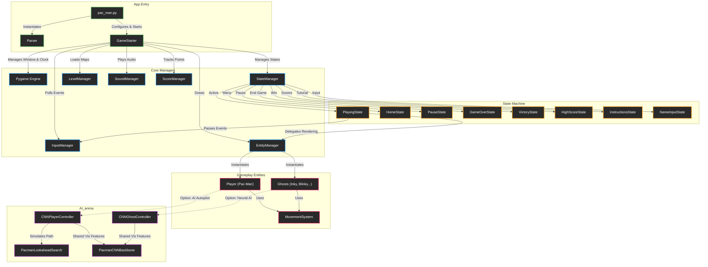

# Project Map: Neon Pac-Man Arcade & AI Engine

## Runtime Architecture

### Breakdown of the Architecture Flow:

1. **App Entry**: `pac_man.py` is the start point. It loads the configuration via `Parser` and kicks off `GameStarter`.
2. **Core Managers**: `GameStarter` is the heart of the game loop. It initializes all the global managers (like Audio, Levels, Scores) and holds the Pygame window context.
3. **State Machine**: The `StateManager` controls what is currently happening on screen. It swaps between `HomeState` (main menu) and `PlayingState` (active game).
4. **Gameplay Entities**: Once in `PlayingState`, the `EntityManager` takes over rendering and updating the physical objects (`Player` and `Ghosts`), which share a `MovementSystem` for collision and grid-snapping.
5. **AI Engine**: If the AI mode is triggered (or configured for ghosts), the entities defer their decision-making to the PyTorch models and Lookahead Search planners in the `AI_arena` directory.

---

## File Index

### Core Game Engine (`src/`)

- **`pac_man.py`**:
  Clean application entry point running the game directly with level configuration.

- **`src/game_loop.py`**:
  `GameStarter` coordinator managing Pygame windowing, frame rate, and global state transitions.

- **`src/graphics/states/playing.py`**:
  Active gameplay state handling frame updates, collision detection, real-time AI inference triggers, in-game cheat activations (`Ctrl + A` for AI Autopilot, `I`, `F`, `B`, `L`, `K`), and HUD rendering.

- **`src/logic/movement.py`**:
  `MovementSystem` managing directional wall checks, grid snapping, BFS pathfinding for hunting ghosts, and flee vectors for frightened ghosts.

- **`src/logic/level_manager.py`**:
  `LevelManager` providing procedural maze generation and level progression.

- **`src/logic/config.py`**:
  Bitmasks (`NORTH`, `EAST`, `SOUTH`, `WEST`), tile geometry constants, and color definitions.

---

### AI Inference & Neural Engine (`AI_arena/`)

- **`AI_arena/player/player_controller.py`**:
  `CNNPlayerController` inference engine. Constructs live observations, queries the Actor-Critic model, applies action masks, integrates the lookahead search planner, and caches cell decisions to eliminate jitter.

- **`AI_arena/player/search_planner.py`**:
  `PacmanLookaheadSearch` high-performance lookahead search engine. Forward-simulates trajectories to evaluate ghost evasion, pellet yields, and dead-end traps.

- **`AI_arena/ghosts/ghost_controller.py`**:
  `CNNGhostController` running multi-ghost inference for Blinky, Pinky, Inky, and Clyde. Supports standard PyTorch weights or dynamic INT8 TorchScript models.

- **`AI_arena/models/cnn_player.py`**:
  `PlayerActorCritic` PyTorch model architecture and `load_checkpoint_into_policy` helper.

- **`AI_arena/models/cnn_ghost.py`**:
  `GhostCNN` PyTorch architecture predicting simultaneous moves for all active ghosts.

- **`AI_arena/models/cnn_backbone.py`**:
  `PacmanCNNBackbone` shared visual feature extractor with spatial convolutions and GRU recurrent memory.

- **`AI_arena/player/data/observation.py`**:
  Constructs live feature vectors (distances to nearest pellets, power pellets, ghosts, and visitation history) for the Pac-Man model.

- **`AI_arena/data/formatter.py`**:
  `ObservationFormatter` converting live grid geometry and entity positions into standardized 6-channel / 12-channel spatial tensors.

