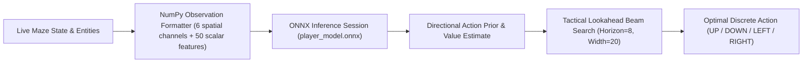

# AI Architecture & Training Branches Guide

Neon Pac-Man features a hybrid Artificial Intelligence engine combining **Deep Convolutional Neural Networks (CNN)** with an **AlphaZero-inspired Lookahead Beam Search**.

---

## 1. Hybrid AI Engine Overview

The AI controller operates in two cooperative stages:

1. **Neural Policy (`player_model.onnx`)**:
   - Computes a fast spatial and relational embedding using a 6-channel convolutional backbone (maze topology, normal pellets, power pellets, player heat map, signed ghost patches, walkable mask) concatenated with 50 scalar features (timers, directional distances, topology junction flags).
   - Outputs action logits and an estimated state value.
2. **Tactical Beam Search (`AI_arena/player/search_planner.py`)**:
   - Forward-simulates ghost and player trajectories up to 8 moves ahead.
   - Applies penalties for 180° corridor reversals, trap dead-ends, and dangerous proximity while rewarding pellet consumption and ghost hunting.
   - Blends neural probabilities with forward simulation for 100% stable, non-oscillating gameplay at a steady **60 FPS** (<9 ms decision latency).

---

## 2. Git Branch Layout & Training Workflow

To preserve evaluation stability and adhere strictly to 42 repository size constraints, the project separates heavy machine learning training from the lightweight evaluation release:

### 🌟 Active Evaluation Branch: `polished-game`
- **Purpose**: Official submission branch for peer evaluation and packaging.
- **Dependencies**: Exclusively lightweight runtime dependencies (`pygame`, `onnxruntime`, `numpy`, `mazegenerator`, `pyinstaller`).
- **No PyTorch**: PyTorch and heavy training dependencies were intentionally removed so that evaluators and players do not need to download gigabytes of CUDA packages.
- **Model**: Ships with the optimized, pre-trained full-precision FP32 ONNX model (`AI_arena/models/player_model.onnx`, 19.5 MB).

### 🔬 Research & Training Branches (`main`, `feature/training`)
- **Purpose**: Neural network design, dataset collection, reinforcement learning (RL), and model distillation.
- **Tooling**: Built using PyTorch, CUDA, and TensorBoard.
- **Training Pipeline**:
  1. **Behavioral Cloning / Supervised Imitation**: Pre-trained on expert search traces.
  2. **PPO / Actor-Critic Fine-Tuning**: Policy optimization balancing pellet collection yield with ghost avoidance.
  3. **AlphaZero-style Policy Distillation**: Distilling multi-step lookahead distributions into the recurrent CNN policy.
  4. **ONNX Export**: Once converged, the top-performing checkpoint (`player_rl_best.pt`) was exported into the standalone FP32 ONNX artifact (`player_model.onnx`) and brought into this branch.
