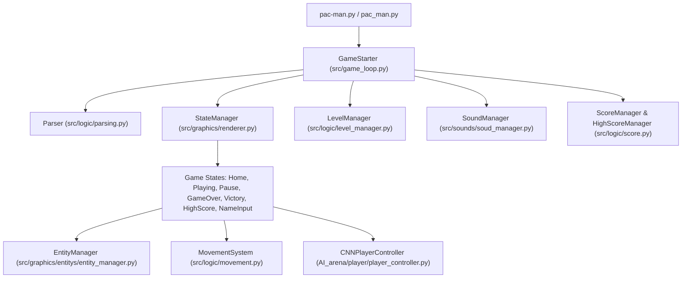

# General Software Architecture

Neon Pac-Man is designed following clean Object-Oriented Programming (OOP) principles, separation of concerns, and classic video game architecture patterns.

---

## 1. High-Level System Overview

---

## 2. Core Subsystems

### 2.1 Game Loop & State Machine (`src/game_loop.py`, `src/graphics/renderer.py`)
- **`GameStarter`**: The main lifecycle controller. Initializes the Pygame display, loads configurations, coordinates window resizing, manages clock ticks (capped at 60 FPS), and delegates frame rendering to the active state.
- **`StateManager` & `State`**: Implementation of the State Pattern. Transitions seamlessly between:
  - `HomeState`: Animated neon main menu with options to start, view highscores, read instructions, or exit.
  - `PlayingState`: Primary gameplay loop handling entity movement, collisions, timers, HUD, and cheat triggers.
  - `PauseState`: Overlay pause menu allowing resume or exit to main menu.
  - `GameOverState` & `VictoryState`: End-game screens displaying final scores.
  - `NameInputState`: Interactive text input for player name submission.
  - `HighScoreState`: Leaderboard display showing the Top 10 scores.

### 2.2 Entity Subsystem (`src/graphics/entitys/`)
- **`EntityManager`**: Owns and updates the collection of active entities: the player and the 4 ghosts.
- **`Player`**: Encapsulates position, grid snapping, speed modifiers, animation state (walk, kick, punch), life counter, and respawn logic.
- **`Ghost`**: Encapsulates ghost behaviors, direction decisions, frightened state timers, prison return paths, and rendering. Each ghost exhibits unique arcade targeting:
  - **Blinky (Red)**: Aggressive direct chaser (targets Pac-Man's exact position).
  - **Pinky (Pink)**: Ambush predator (targets cells ahead of Pac-Man's direction).
  - **Inky (Cyan)**: Tactical flanker (triangulates position relative to Blinky and Pac-Man).
  - **Clyde (Orange)**: Distance-sensitive guard (chases when distant, retreats to corner when near).

### 2.3 Grid & Movement System (`src/logic/movement.py`)
- **Tile-based Corridor Navigation**: Entities move along continuous coordinates while aligning with integer grid cells.
- **Junction Snapping**: Smooth corner turning prevents entities from getting stuck on corridor walls.
- **BFS Distance Precomputation**: Real-time breadth-first search evaluates exact shortest paths across the labyrinth, supporting both ghost pursuit and AI player lookahead.

### 2.4 Audio Subsystem (`src/sounds/soud_manager.py`)
- Manages simultaneous sound effect playback and background ambiance.
- Implements audio ducking to prevent sound clipping during high-intensity events (e.g. eating consecutive pellets or capturing ghosts).
