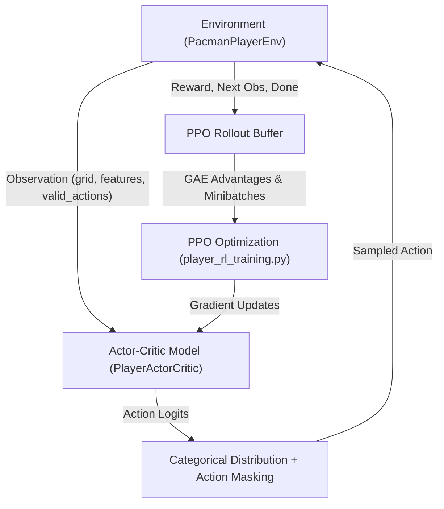

# Detailed Technical Explanation: Pac-Man Player RL System

This document provides a line-by-line breakdown of the Reinforcement Learning system built for training **Pac-Man (the Player)** against **BFS Ghosts**.

---

## 1. System Overview & Data Flow



---

## 2. File 1: Headless RL Environment (`AI_arena/pacman_player_env.py`)

### Lines 1–48: Headless Initialization & Imports
```python
import os
os.environ["SDL_VIDEODRIVER"] = "dummy"
```
- Forces Pygame to run without opening an actual OS graphical window ("dummy" driver). This allows fast, headless simulation on servers or GPUs.

```python
import pygame
pygame.init()
if not pygame.display.get_surface():
    pygame.display.set_mode((1, 1))
```
- Initializes Pygame modules and creates a 1x1 hidden surface required for Pygame's image scaling and sprite engine to run without errors.

```python
from src.graphics.entitys.graphic_lib import SpriteLibrary
from src.logic.config import CELL_SIZE
SpriteLibrary.instance().load(CELL_SIZE)
SpriteLibrary.instance().load_ghosts(CELL_SIZE)
```
- Loads and scales sprite frame assets into memory once.

### Lines 50–78: Class Definition & `__init__`
```python
class PacmanPlayerEnv:
    def __init__(self, seed: int | None = None, maze_width: int = 20, maze_height: int = 25, max_steps: int = 1500) -> None:
```
- `seed`: Random seed for reproducible maze generation and fallback action selection.
- `maze_width`, `maze_height`: Dimensions of the generated Pac-Man maze (default 20x25).
- `max_steps`: Episode step limit (prevents infinite loops if Pac-Man gets stuck).
- `self.device`: Automatically selects PyTorch `cuda` if an NVIDIA GPU is present, otherwise falls back to `cpu`.

### Lines 79–104: `reset()`
```python
def reset(self) -> tuple[torch.Tensor, torch.Tensor, torch.Tensor]:
```
- Resets the episode step counter to 0.
- Calls `LevelManager.build_maze()` to generate a randomized maze.
- Instantiates `MovementSystem(self.maze)` to handle wall collisions and BFS algorithms.
- Spawns Pac-Man at the maze center and 4 Ghosts at the 4 maze corners (`_create_entities()`).
- Fills the maze with regular pellets and super power pellets (`_create_pellets()`).
- Returns the initial observation triple `(grid, features, valid_actions)`.

### Lines 105–167: `step(action)`
```python
def step(self, action: int | torch.Tensor)
```
1. **Action Validation**: Checks if `action` (0=UP, 1=DOWN, 2=LEFT, 3=RIGHT) is legal according to `valid_actions`. If Pac-Man tries to move into a wall, it selects a random legal direction as fallback.
2. **Direction Assignment**: Sets `self.player.next_direction = DIRECTIONS[action]`.
3. **Simulation Ticks**: Runs 2 sub-ticks of physics updates (`_update_entities()`) and collision checks (`_check_events()`).
4. **Reward & Termination**:
   - `terminated`: True if Pac-Man died or level cleared.
   - `truncated`: True if `step_count >= max_steps`.
5. Returns `(next_observation, reward, done, info)`.

### Lines 235–259: Entity Updates & BFS Ghost Intelligence (`_update_entities`)
```python
def _update_entities(self) -> None:
    self.movement.update_entity(self.player)
    ...
    for ghost in self.ghosts:
        if ghost.in_prison:
            self.movement.move_inside_prison(ghost)
        elif ghost.is_edible:
            self.movement.update_runaway_ghost(ghost, self.player)
        else:
            self.movement.update_bfs_ghost(ghost, self.player)
```
- Pac-Man moves according to the RL policy action.
- **Ghosts AI**:
  - In prison: execute prison bounce loop.
  - Edible (powered mode): run away from Pac-Man using zone-based runaway targeting.
  - Normal mode: execute **shortest-path BFS pathfinding** (`update_bfs_ghost`) targeting Pac-Man's exact grid coordinates!

### Lines 331–431: Observation Generator (`_get_observation`)
Returns three PyTorch tensors:
1. **`grid` `[1, 12, 50, 25]`**:
   - Channels 0..3: Wall bitmasks (North, South, West, East).
   - Channel 4: Normal pellet positions (1.0 where present).
   - Channel 5: Super power pellet positions (1.0 where present).
   - Channel 6: Pac-Man location (1.0 at `player_y, player_x`).
   - Channels 7..10: Ghost locations (1.0 for Blinky, Pinky, Inky, Clyde).
   - Channel 11: Walkable cell mask.
2. **`extra_features` `[1, 37]`**:
   - `[0:4]`: Pac-Man current direction (one-hot).
   - `[4]`: Player powered flag (1.0 if ghosts edible, else 0.0).
   - `[5:9]`: Ghost edible status for each of the 4 ghosts.
   - `[9:21]`: Normalized relative $(X, Y)$ vectors and BFS distances from Pac-Man to all 4 ghosts.
   - `[21:37]`: One-hot directions for each of the 4 ghosts ($4 \times 4 = 16$).
3. **`valid_actions` `[1, 4]`**:
   - Boolean mask `[UP, DOWN, LEFT, RIGHT]` indicating legal non-wall moves for Pac-Man at current position.

---

## 3. File 2: Actor-Critic Model Architecture (`AI_arena/player_cnn_model.py`)

### Lines 15–30: Spatial Convolutional Neural Network (CNN)
```python
self.cnn = nn.Sequential(
    nn.Conv2d(12, 32, kernel_size=3, padding=1),
    nn.ReLU(),
    nn.MaxPool2d(2),
    nn.Conv2d(32, 64, kernel_size=3, padding=1),
    nn.ReLU(),
    nn.MaxPool2d(2),
    nn.Conv2d(64, 128, kernel_size=3, padding=1),
    nn.ReLU(),
)
```
- **Spatial Processing**: Processes the 12-channel 2D spatial maze grid.
- **Dimensionality Reduction**:
  - Input: $[12, 50, 25]$
  - After Pool 1: $[32, 25, 12]$
  - After Pool 2: $[64, 12, 6]$
  - Final CNN output: $[128, 12, 6] \rightarrow$ Flattened size = $128 \times 12 \times 6 = 9,216$ features.

### Lines 32–45: Feature Fusion Trunk & Heads
```python
flattened_cnn_dim = 128 * 12 * 6 # 9216
total_feature_dim = flattened_cnn_dim + EXTRA_FEATURE_COUNT # 9216 + 37 = 9253

self.trunk = nn.Sequential(
    nn.Linear(9253, 256),
    nn.ReLU(),
    nn.Dropout(0.1),
    nn.Linear(256, 128),
    nn.ReLU(),
)

self.actor = nn.Linear(128, 4)  # Action logits for UP, DOWN, LEFT, RIGHT
self.critic = nn.Linear(128, 1) # Estimated state value V(s)
```
- **Feature Fusion**: Combines flattened 2D spatial features with 37 1D game-state features into a unified 9,253-element vector.
- **Actor Head**: Predicts unnormalized action preference logits $[ \text{logit}_{\text{UP}}, \text{logit}_{\text{DOWN}}, \text{logit}_{\text{LEFT}}, \text{logit}_{\text{RIGHT}} ]$.
- **Critic Head**: Predicts scalar state value $V(s)$ representing expected cumulative future rewards.

---

## 4. File 3: PPO Reinforcement Learning Pipeline (`AI_arena/player_rl_training.py`)

### Lines 72–105: Rollout Collection Phase
```python
for _ in range(rollout_steps):
    grid, features, valid_actions = obs
    logits, value = policy(grid, features)
    
    # HARD ACTION MASKING
    masked_logits = logits.masked_fill(~valid_actions, -1e9)
    dist = Categorical(logits=masked_logits)
    action = dist.sample()
    log_prob = dist.log_prob(action)
    
    next_obs, reward, done, info = env.step(action.item())
```
- **Action Masking**: Forces blocked directions to have logit $-\infty$ ($-10^9$). This ensures `softmax` assigns $0\%$ probability to illegal moves, so Pac-Man never attempts to run into walls.

### Lines 106–136: Generalized Advantage Estimation (GAE)
```python
delta = b_rewards[t] + gamma * next_val * next_non_terminal - b_values[t]
advantages[t] = last_gae_lam = delta + gamma * gae_lambda * next_non_terminal * last_gae_lam
returns = advantages + b_values
```
- **Temporal Difference Residual ($\delta_t$)**:
  $$\delta_t = r_t + \gamma V(s_{t+1}) (1 - d_t) - V(s_t)$$
- **GAE Advantage ($A_t$)**:
  $$A_t = \delta_t + (\gamma \lambda) (1 - d_t) A_{t+1}$$
- Quantifies how much better an action was compared to the baseline expectation $V(s_t)$.

### Lines 137–182: PPO Optimization Epochs & Loss Function
```python
log_ratio = new_log_probs - mb_old_log_probs
ratio = torch.exp(log_ratio)

surr1 = ratio * mb_adv
surr2 = torch.clamp(ratio, 1.0 - clip_eps, 1.0 + clip_eps) * mb_adv
policy_loss = -torch.min(surr1, surr2).mean()

value_loss = F.mse_loss(values.squeeze(-1), mb_returns)
loss = policy_loss + value_coef * value_loss - entropy_coef * entropy
```
1. **Probability Ratio ($r_t(\theta)$)**:
   $$r_t(\theta) = \frac{\pi_\theta(a_t | s_t)}{\pi_{\theta_{\text{old}}}(a_t | s_t)}$$
2. **Clipped Surrogate Loss**:
   Presents policy collapse by clipping ratio $r_t(\theta)$ within $[1-\epsilon, 1+\epsilon]$ (where $\epsilon=0.2$).
3. **Total Loss**:
   $$L_{\text{PPO}} = L_{\text{CLIP}} + c_1 L_{\text{VALUE}} - c_2 H(\pi_\theta)$$
   - $L_{\text{VALUE}}$: Minimizes error in value estimation.
   - $H(\pi_\theta)$: Entropy bonus encouraging policy exploration.

---

## 5. File 4: Live Inference Controller (`AI_arena/player_controller.py`)

### Lines 56–150: `predict()`
- Receives live game objects (`maze`, `pellets`, `player`, `ghosts`, `movement`).
- Extracts observation tensors using `_entity_position()`.
- Executes deterministic inference (`torch.inference_mode()`):
```python
with torch.inference_mode():
    logits, _ = self.model(grid, extra_features)
    masked_logits = logits.masked_fill(~valid_actions, float("-inf"))
    best_action_idx = masked_logits.argmax(dim=-1).item()
    return DIRECTIONS[best_action_idx]
```
- Selects the action with the highest logit (`argmax`) among legal moves and returns `"UP"`, `"DOWN"`, `"LEFT"`, or `"RIGHT"`.
