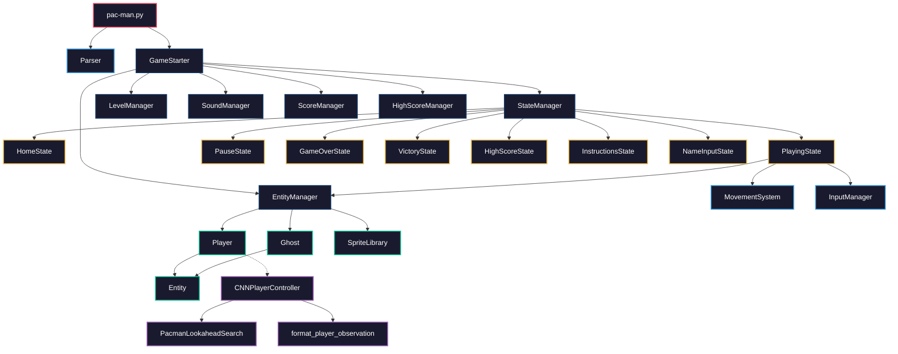

# Project Architecture & Analysis

This document explains the project structure, all classes and files, and how they relate to each other.

---

## High-Level Architecture

The project follows the **State Pattern** for screen management and a **Manager Pattern** for game subsystems. Here is the full dependency flow:



---

## Directory Structure

```
pac-man.py                           # 🚀 Entry point
config.json                          # ⚙️ Game configuration (levels, lives, seeds)
Makefile                             # 🔧 make run / install / clean / lint
│
├── src/                             # 🎮 GAME ENGINE
│   ├── game_loop.py                 #   └── GameStarter (main loop, 60fps)
│   │
│   ├── graphics/                    #   └── RENDERING LAYER
│   │   ├── renderer.py              #       ├── State (base class)
│   │   │                            #       └── StateManager (stack-based state machine)
│   │   ├── ui_helpers.py            #       └── Font initialization, color constants
│   │   ├── UI/
│   │   │   └── button.py            #       ├── Button
│   │   │                            #       └── ButtonManager
│   │   ├── entitys/
│   │   │   ├── entity.py            #       └── Entity (base: x, y, speed, direction)
│   │   │   ├── player.py            #       └── Player(Entity) — Pac-Man
│   │   │   ├── ghost.py             #       └── Ghost(Entity) — Blinky, Pinky, Inky, Clyde
│   │   │   ├── entity_manager.py    #       └── EntityManager (spawns Player + 4 Ghosts)
│   │   │   └── graphic_lib.py       #       └── SpriteLibrary, Animation, Enums
│   │   └── states/
│   │       ├── home.py              #       └── HomeState(State) — Main menu
│   │       ├── playing.py           #       └── PlayingState(State) — Active gameplay
│   │       ├── pause.py             #       └── PauseState(State) — Pause screen
│   │       ├── game_over.py         #       └── GameOverState(State) — Death screen
│   │       ├── vectory.py           #       └── VictoryState(State) — Win screen
│   │       ├── high_score.py        #       └── HighScoreState(State) — Leaderboard
│   │       ├── instructions.py      #       └── InstructionsState(State) — Tutorial
│   │       └── name_input.py        #       └── NameInputState(State) — Name entry
│   │
│   ├── logic/                       #   └── GAME LOGIC LAYER
│   │   ├── config.py                #       └── GameConfig, LevelConfig, constants
│   │   ├── parsing.py               #       └── Parser (JSON config reader)
│   │   ├── movement.py              #       └── MovementSystem (BFS, wall checks, snapping)
│   │   ├── level_manager.py         #       └── LevelManager (A-Maze-ing integration)
│   │   ├── inputmanager.py          #       └── InputManager, InputState (keyboard events)
│   │   ├── score.py                 #       └── ScoreManager, HighScoreManager
│   │   ├── expert.py                #       └── PacmanExpert (rule-based AI fallback)
│   │   └── helpers.py               #       └── grid_to_pixel(), pixel_to_screen()
│   │
│   └── sounds/                      #   └── AUDIO LAYER
│       └── soud_manager.py          #       └── SoundManager (sound effects + music)
│
├── AI_arena/                        # 🧠 AI NEURAL ENGINE
│   ├── models/
│   │   ├── player_model.onnx        #   └── Trained Pac-Man neural weights (ONNX)
│   │   ├── cnn_player.py            #   └── PlayerActorCritic (PyTorch architecture)
│   │   ├── cnn_ghost.py             #   └── GhostCNN (multi-ghost neural architecture)
│   │   └── cnn_backbone.py          #   └── PacmanCNNBackbone (shared CNN + GRU)
│   ├── player/
│   │   ├── player_controller.py     #   └── CNNPlayerController (ONNX inference)
│   │   ├── search_planner.py        #   └── PacmanLookaheadSearch (tactical beam search)
│   │   └── data/
│   │       └── observation.py       #   └── format_player_observation() (live tensors)
│   ├── ghosts/
│   │   └── ghost_controller.py      #   └── CNNGhostController (ghost AI inference)
│   └── data/
│       └── formatter.py             #   └── ObservationFormatter (spatial tensor builder)
│
└── assets/                          # 🎨 Sprites, fonts, sounds
```

---

## Class Relationships

### Inheritance Hierarchy

```
State (renderer.py)                  # Abstract base class for all screens
├── HomeState (home.py)              # Main menu — "Start", "Highscores", "Instructions", "Exit"
├── PlayingState (playing.py)        # Active gameplay — collision, cheats, AI toggle
├── PauseState (pause.py)            # Pause overlay
├── GameOverState (game_over.py)     # Death screen — shows score
├── VictoryState (vectory.py)        # Level complete screen
├── HighScoreState (high_score.py)   # Top 10 leaderboard display
├── InstructionsState (instructions.py)  # Controls tutorial
└── NameInputState (name_input.py)   # Player name entry (max 10 chars)

Entity (entity.py)                   # Base class: spawn position, x/y, speed, direction
├── Player (player.py)               # Pac-Man: score, abilities, sprite animations
└── Ghost (ghost.py)                 # Ghost: is_edible, is_eaten, prison logic, flee timers
```

### Composition ("has-a") Relationships

```
GameStarter
├── has StateManager           → manages the active State via a stack
├── has LevelManager           → generates mazes using A-Maze-ing package
├── has SoundManager           → plays sound effects and background music
├── has ScoreManager           → tracks current game score
├── has HighScoreManager       → loads/saves top 10 scores to JSON file
├── has EntityManager          → creates and manages Player + 4 Ghosts
└── stores GameConfig          → parsed from config.json by Parser

EntityManager
├── has 1 Player               → the Pac-Man entity
├── has 4 Ghosts               → Blinky (red), Pinky (pink), Inky (cyan), Clyde (orange)
├── has SpriteLibrary          → singleton that loads all sprite animations
└── manages pellets[]          → 2D grid of pellet positions

PlayingState
├── uses EntityManager         → to update and draw all entities each frame
├── uses MovementSystem        → for BFS pathfinding, wall checks, grid snapping
├── uses InputManager          → to process keyboard events (WASD, arrows, cheats)
├── optionally uses CNNPlayerController  → when AI autopilot is toggled (Ctrl+A)
└── manages cheats             → invincibility, freeze, speed, skip, hunter mode

CNNPlayerController
├── loads ONNX model           → player_model.onnx via onnxruntime
├── uses format_player_observation()  → builds live feature vectors for inference
└── uses PacmanLookaheadSearch → tactical beam search to prevent fatal AI moves
```

---

## Data Flow: One Game Frame

```
1. pac-man.py          → Parser reads config.json → creates GameConfig
2. GameStarter.run()   → initializes pygame, creates all managers
3. Main Loop (60fps):
   │
   ├── pygame.event.get()    → raw keyboard/mouse events
   ├── InputManager.update() → converts to InputState (directions, cheats, quit)
   │
   ├── StateManager.update() → delegates to current State:
   │   │
   │   └── PlayingState.update():
   │       ├── MovementSystem.move_player()  → checks walls, snaps to grid
   │       ├── MovementSystem.move_ghosts()  → BFS chase / flee pathfinding
   │       ├── EntityManager.check_collisions() → pellet eating, ghost contact
   │       ├── ScoreManager.add_points()     → updates score
   │       ├── [Optional] CNNPlayerController.predict() → AI autopilot direction
   │       └── Check win/loss → change_state(VictoryState / GameOverState)
   │
   ├── screen.fill(black)
   ├── StateManager.draw()   → current state renders to screen
   └── pygame.display.flip() → display frame
```

---

## Design Patterns Used

| Pattern | Where | Purpose |
|---|---|---|
| **State Pattern** | `State` → `HomeState`, `PlayingState`, etc. | Clean separation of game screens. Each screen handles its own input, update, and draw. |
| **Manager Pattern** | `GameStarter` holds `StateManager`, `LevelManager`, `SoundManager`, etc. | Centralized control of game subsystems. |
| **Singleton** | `SpriteLibrary.instance()` | One shared sprite atlas for all entities. |
| **Strategy Pattern** | `MovementSystem` provides different movement strategies for chase vs. flee | Ghosts switch between BFS pursuit and flee vector based on edible state. |
| **Observer-like** | `InputManager` → `InputState` consumed by current `State` | Decouples input polling from game logic. |
