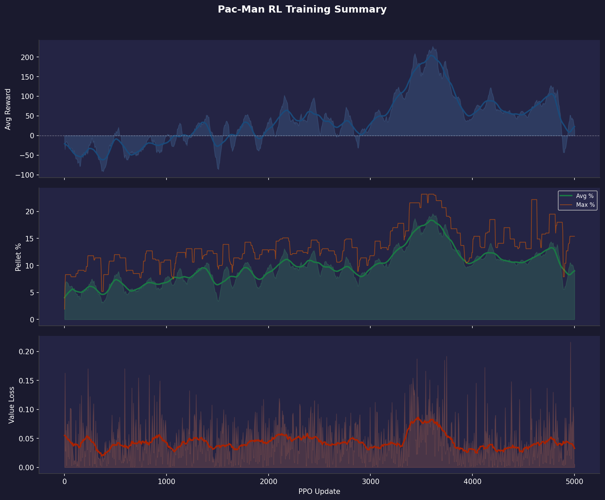

# Training Report 002 — PPO Stage-1 — 5000 Updates Run 2

Generated: 2026-08-02 07:14  
Log file: `RL-logs.txt`

---

## Run Configuration

| Parameter | Value |
|-----------|-------|
| PPO Updates | 1 → 5000 (1001 logged) |
| Total Episodes | 1706 |
| Rollout Steps / Update | 512 |
| PPO Epochs | 4 |
| Mini-batch Size | 64 |
| Learning Rate | 3e-4 |
| Gamma (γ) | 0.99 |
| GAE Lambda (λ) | 0.95 |
| Clip ε | 0.2 |
| Entropy Coef | 0.02 |
| Value Coef | 0.5 |
| Max Grad Norm | 0.5 |

---

## Observation Format

Each step the model receives **3 tensors**:

### 1. Grid (`[1, C, H, W]` CNN input)
| Channel | Content |
|---------|---------|
| 0 | Walls (maze structure) |
| 1 | Pellets (normal, value 1) |
| 2 | Super-pellets (value 2) |
| 3 | Player position |
| 4 | Ghosts (all combined) |
| 5 | BFS distance-to-player heatmap (normalized) |

### 2. Extra Features (`[1, F]` MLP input)
| Feature | Description |
|---------|-------------|
| player_grid_x | Normalized column position |
| player_grid_y | Normalized row position |
| remaining_pellets | Fraction of pellets left |
| ghost_count | Number of active ghosts |
| ghost_min_dist | Closest ghost BFS distance (normalized) |
| powered_mode | 1 if player is in powered/attack mode |

### 3. Valid Actions (`[1, 4]` mask)
Binary mask over `[UP, DOWN, LEFT, RIGHT]` — invalid moves are masked to −∞ before softmax.

---

## Reward System

| Event | Reward |
|-------|--------|
| Every step (base penalty) | **−0.1** |
| First visit to a new grid tile | **+1.0** |
| Pellet eaten | **+3.0** |
| Super-pellet eaten | **+5.0** |
| Level completed | **+100.0** |
| Pac-Man died | **−20.0** |

**Net examples:**
- Step forward into a new pellet tile: `−0.1 + 1.0 + 3.0 = +3.9`
- Step forward into a new empty tile: `−0.1 + 1.0 = +0.9`
- Step forward into an already-visited tile: `−0.1`

---

## Results Summary

| Metric | Value | At Update |
|--------|-------|-----------|
| Best raw avg reward | 227.3 | 3610 |
| Best smoothed avg reward | 203.8 | 3595 |
| Best avg pellet % | 19.6% | 3610 |
| Best max pellet % | 23.2% | 3500 |
| Final avg reward | 13.9 | 5000 |
| Final avg pellet % | 8.5% | 5000 |
| Final max pellet % | 15.4% | 5000 |

---

## Plots

| File | Description |
|------|-------------|
| `00_overview.png` | Combined 3-panel summary (reward / pellets / value loss) |
| `01_avg_reward.png` | Average episode reward over updates |
| `02_pellet_completion.png` | Pellet completion % (avg & max) |
| `03_value_loss.png` | Value network loss |

---

## Notes / Observations

- Training data covers updates 1–5000 (1706 episodes).
- Clean exploration baseline with step penalty `-0.1` and new tile bonus `+1.0` allowed the policy to break out of spatial collapse.
- Peak performance reached at Update 3500-3610 with max 112 pellets gathered (23.2% completion) and max average reward of +227.3.
- Model showed significant recovery and growth compared to Report 001.
- Saved checkpoint: `reports/report_002/player_rl_stage1.pt`.
