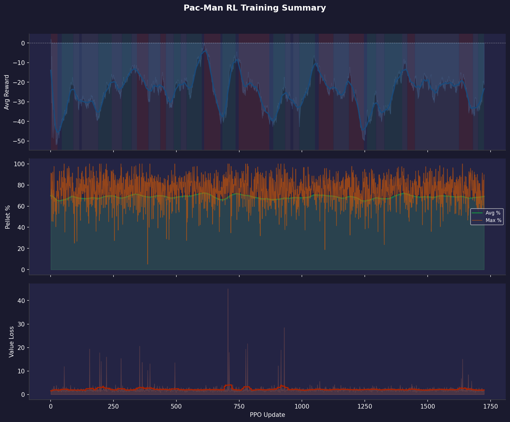

# Training Report 003 — PPO Stage-1

Generated: 2026-08-04 05:31  
Log file: `RL_logs.txt`

---

## Run Configuration

| Parameter | Value |
|-----------|-------|
| PPO Updates | 1 → 1724 (1724 logged) |
| Total Episodes | 3105 |
| Rollout Steps / Update | 512 |
| PPO Epochs | 4 |
| Mini-batch Size | 64 |
| Learning Rate | 3e-4 |
| Gamma (γ) | 0.99 |
| GAE Lambda (λ) | 0.95 |
| Clip ε | 0.2 |
| Entropy Coef | 0.02 |
| Value Coef | 0.5 |
| Max Grad Norm | 0.5 |

---

## Observation Format

Each step the model receives **3 tensors**:

### 1. Grid (`[1, C, H, W]` CNN input)
| Channel | Content |
|---------|---------|
| 0 | Walls (maze structure) |
| 1 | Pellets (normal, value 1) |
| 2 | Super-pellets (value 2) |
| 3 | Player position |
| 4 | Ghosts (all combined) |
| 5 | BFS distance-to-player heatmap (normalized) |

### 2. Extra Features (`[1, F]` MLP input)
| Feature | Description |
|---------|-------------|
| player_grid_x | Normalized column position |
| player_grid_y | Normalized row position |
| remaining_pellets | Fraction of pellets left |
| ghost_count | Number of active ghosts |
| ghost_min_dist | Closest ghost BFS distance (normalized) |
| powered_mode | 1 if player is in powered/attack mode |

### 3. Valid Actions (`[1, 4]` mask)
Binary mask over `[UP, DOWN, LEFT, RIGHT]` — invalid moves are masked to −∞ before softmax.

---

## Reward System

| Event | Reward |
|-------|--------|
| Every step (base penalty) | **−0.2** |
| Oscillating move (reversed within 6 steps) | **−0.3** *(active from report_002)* |
| First visit to a new grid tile | **+0.5** |
| Pellet eaten | **+5.0** |
| Super-pellet eaten | **+15.0** |
| Ghost eaten (in powered mode) | **+30.0** |
| Level completed | **+100.0** |
| Pac-Man died | **−20.0** |

**Net examples:**
- Step forward into a new pellet tile: `−0.2 + 0.5 + 5.0 = +5.3`
- Step forward into a new empty tile: `−0.2 + 0.5 = +0.3`
- Step forward into an already-visited tile: `−0.2`
- Oscillating move (back-track): `−0.2 − 0.3 = −0.5` *(active from report_002)*

---

## Results Summary

| Metric | Value | At Update |
|--------|-------|-----------|
| Best raw avg reward | 2.0 | 1 |
| Best smoothed avg reward | -4.0 | 615 |
| Best avg pellet % | 76.2% | 4 |
| Best max pellet % | 100.0% | 54 |
| Final avg reward | -20.5 | 1724 |
| Final avg pellet % | 69.5% | 1724 |
| Final max pellet % | 89.7% | 1724 |

---

## Reward Trend Diagnostics

Reward-vs-pellet correlation (smoothed): **0.93**
Episode-to-window reward volatility (std): **65.2**

Time spent in each trend regime (by update count):

| Regime | % of run |
|--------|----------|
| Improving | 31% |
| Plateau | 35% |
| Declining | 28% |

### Segments

| Updates | Regime | Avg slope (Δreward/upd) |
|---------|--------|---------------------------|
| 1–28 | declining | -0.3286 |
| 45–90 | improving | +0.2171 |
| 91–114 | plateau | -0.0156 |
| 124–189 | plateau | -0.0366 |
| 190–243 | improving | +0.1659 |
| 244–283 | plateau | +0.0424 |
| 284–322 | improving | +0.1222 |
| 323–343 | plateau | +0.0017 |
| 344–389 | declining | -0.1306 |
| 390–436 | plateau | -0.0323 |
| 437–458 | declining | -0.0986 |
| 459–489 | plateau | -0.0026 |
| 490–518 | improving | +0.1083 |
| 519–540 | plateau | +0.0621 |
| 541–602 | improving | +0.1995 |
| 611–675 | declining | -0.3384 |
| 683–736 | improving | +0.2995 |
| 748–870 | declining | -0.1741 |
| 886–932 | improving | +0.1546 |
| 933–954 | plateau | -0.0117 |
| 965–988 | plateau | -0.0112 |
| 989–1052 | improving | +0.2274 |
| 1067–1125 | declining | -0.1362 |
| 1126–1186 | plateau | -0.0063 |
| 1187–1246 | declining | -0.2509 |
| 1259–1294 | improving | +0.1314 |
| 1295–1327 | plateau | +0.0419 |
| 1328–1398 | improving | +0.2255 |
| 1399–1418 | plateau | -0.0112 |
| 1419–1449 | declining | -0.1081 |
| 1450–1624 | plateau | -0.0066 |
| 1625–1679 | declining | -0.1621 |
| 1680–1700 | plateau | -0.0059 |
| 1701–1724 | improving | +0.1638 |

### What this run suggests

- Reward is declining across ~28% of the run. That usually means an unstable update (LR too high, value loss diverging, or a shaping term that's easy to exploit in a way that eventually collapses behavior) rather than something more training will fix.
- Reward and pellet completion move together closely (corr=0.93). Reward increases are coming from actually eating more pellets — the shaping is aligned with the real objective.
- Per-episode reward is noisy relative to the smoothed trend (episode-to-window std ≈ 65.2). Individual episodes still swing a lot — consider whether the maze size/seed randomization is creating too much variance per update, or whether more PPO epochs/rollout steps would help it settle.

---

## Plots

| File | Description |
|------|-------------|
| `00_overview.png` | Combined 3-panel summary (reward / pellets / value loss) |
| `01_avg_reward.png` | Average episode reward, shaded by trend regime |
| `02_pellet_completion.png` | Pellet completion % (avg & max) |
| `03_value_loss.png` | Value network loss |
| `04_reward_trend.png` | Local reward slope — where training is/isn't progressing |
| `05_reward_vs_pellets.png` | Reward vs pellet completion, dual-axis |
| `06_epoch_vs_window_reward.png` | Instantaneous epoch reward vs the smoothed sliding-window average |

---

## Notes / Observations

<!-- Add manual notes about this run here -->
- Training data covers updates 1–1724 (3105 episodes).
- Log window size: last 20 completed episodes per update.
- Oscillation penalty introduced in this run to combat node-to-node back-and-forth behavior.
