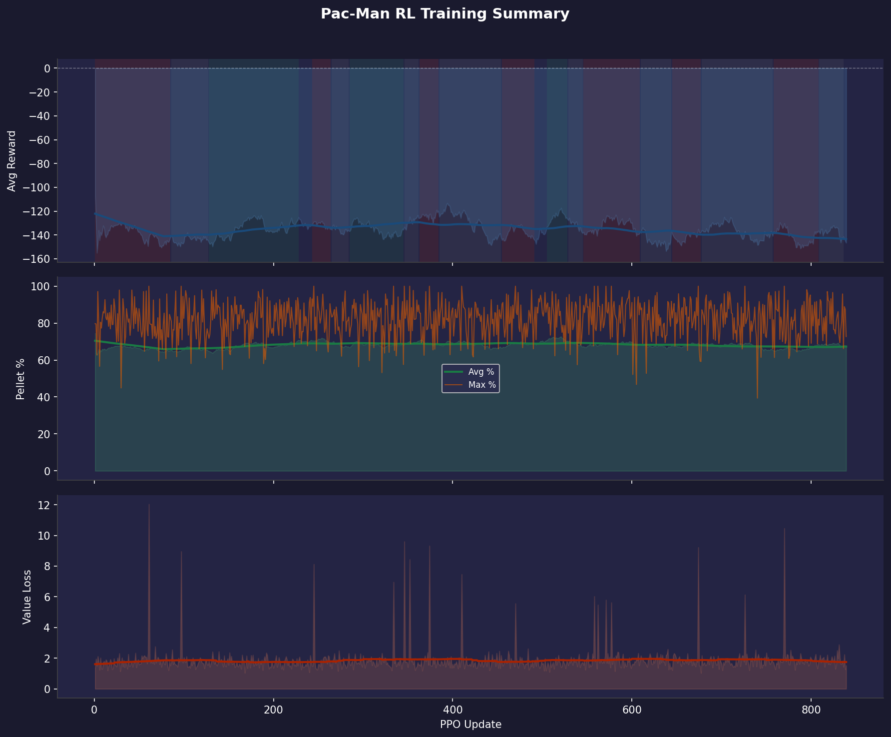

# Training Report 005 — PPO Stage-1

Generated: 2026-08-03 08:04  
Log file: `RL_logs.txt`

---

## Run Configuration

| Parameter | Value |
|-----------|-------|
| PPO Updates | 1 → 2155 (432 logged) |
| Total Episodes | 2823 |
| Rollout Steps / Update | 512 |
| PPO Epochs | 4 |
| Mini-batch Size | 64 |
| Learning Rate | 3e-4 |
| Gamma (γ) | 0.99 |
| GAE Lambda (λ) | 0.95 |
| Clip ε | 0.2 |
| Entropy Coef | 0.02 |
| Value Coef | 0.5 |
| Max Grad Norm | 0.5 |

---

## Observation Format

Each step the model receives **3 tensors**:

### 1. Grid (`[1, C, H, W]` CNN input)
| Channel | Content |
|---------|---------|
| 0 | Walls (maze structure) |
| 1 | Pellets (normal, value 1) |
| 2 | Super-pellets (value 2) |
| 3 | Player position |
| 4 | Ghosts (all combined) |
| 5 | BFS distance-to-player heatmap (normalized) |

### 2. Extra Features (`[1, F]` MLP input)
| Feature | Description |
|---------|-------------|
| player_grid_x | Normalized column position |
| player_grid_y | Normalized row position |
| remaining_pellets | Fraction of pellets left |
| ghost_count | Number of active ghosts |
| ghost_min_dist | Closest ghost BFS distance (normalized) |
| powered_mode | 1 if player is in powered/attack mode |

### 3. Valid Actions (`[1, 4]` mask)
Binary mask over `[UP, DOWN, LEFT, RIGHT]` — invalid moves are masked to −∞ before softmax.

---

## Reward System
        reward = -0.5  # One-time cost per cell crossing (was -0.1 × ~11 ticks)

        if events.get("new_tile_visited", False):
            reward += 1.5  # Exploration bonus — net +1.45 for an empty new cell

        if events.get("oscillating", False):
            reward -= 0.5  # Discourage A→B→A oscillation without hard blocking

        if events["pellet_eaten"]:
            reward += 5.0  # Net +6.45 on a new pellet tile

        if events["super_pellet_eaten"]:
            reward += 10.0

        if events["ghost_eaten"]:
            reward += 30.0

        if events["level_completed"]:
            reward += 200.0  # Very strong completion incentive

        if events["pacman_died"]:
            reward -= 30.0

        return reward

---

## Results Summary

| Metric | Value | At Update |
|--------|-------|-----------|
| Best raw avg reward | 152.9 | 740 |
| Best smoothed avg reward | 123.1 | 435 |
| Best avg pellet % | 53.9% | 5 |
| Best max pellet % | 93.7% | 1215 |
| Final avg reward | 102.8 | 2155 |
| Final avg pellet % | 41.7% | 2155 |
| Final max pellet % | 77.4% | 2155 |

---

## Plots

| File | Description |
|------|-------------|
| `00_overview.png` | Combined 3-panel summary (reward / pellets / value loss) |
| `01_avg_reward.png` | Average episode reward over updates |
| `02_pellet_completion.png` | Pellet completion % (avg & max) |
| `03_value_loss.png` | Value network loss |



---

## Notes / Observations

<!-- Add manual notes about this run here -->
- Training data covers updates 1–2155 (2823 episodes).
- Log window size: last 20 completed episodes per update.
- Oscillation penalty introduced in this run to combat node-to-node back-and-forth behavior.


```uv run python -u -m AI_arena.player.player_training \
                                                 --stage 1 \
                                                 --num-updates 100 \
                                                 --save-interval 50 \
                                                 2>&1 | tee RL_logs.txt
                                        
```