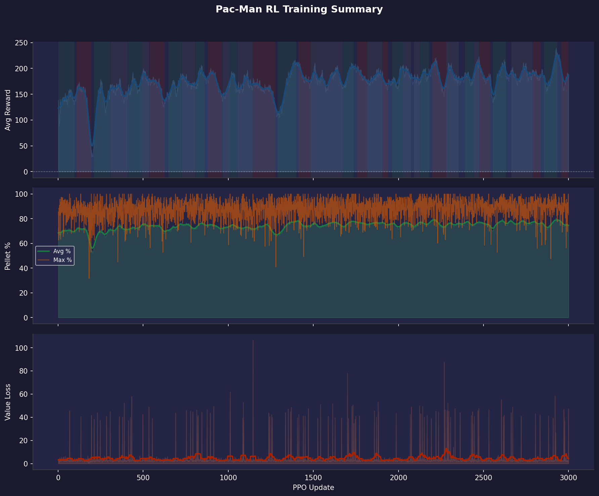

# Training Report 006 — PPO Stage-1

Generated: 2026-08-05 10:21  
Log file: `training_log.txt`

---

## Run Configuration

| Parameter | Value |
|-----------|-------|
| PPO Updates | 1 → 3000 (3000 logged) |
| Total Episodes | 10930 |
| Rollout Steps / Update | 1024 |
| PPO Epochs | 4 |
| Mini-batch Size | 64 |
| Learning Rate | 1e-4 |
| Gamma (γ) | 0.99 |
| GAE Lambda (λ) | 0.95 |
| Clip ε | 0.2 |
| Entropy Coef | 0.05 |
| Value Coef | 0.5 |
| Max Grad Norm | 0.5 |

---

## Observation Format

Each step the model receives **3 tensors**:

### 1. Grid (`[1, C, H, W]` CNN input)
| Channel | Content |
|---------|---------|
| 0 | Walls (maze structure) |
| 1 | Pellets (normal, value 1) |
| 2 | Super-pellets (value 2) |
| 3 | Player position |
| 4 | Ghosts (all combined) |
| 5 | BFS distance-to-player heatmap (normalized) |

### 2. Extra Features (`[1, F]` MLP input)
| Feature | Description |
|---------|-------------|
| player_grid_x | Normalized column position |
| player_grid_y | Normalized row position |
| remaining_pellets | Fraction of pellets left |
| ghost_count | Number of active ghosts |
| ghost_min_dist | Closest ghost BFS distance (normalized) |
| powered_mode | 1 if player is in powered/attack mode |

### 3. Valid Actions (`[1, 4]` mask)
Binary mask over `[UP, DOWN, LEFT, RIGHT]` — invalid moves are masked to −∞ before softmax.

---

## Reward System (as implemented in `player_env.py`)

| Event | Reward |
|-------|--------|
| Every step (base penalty) | **−0.2** |
| Oscillating move (A→B→A) | **−0.5** |
| Pellet eaten | **+5.0** |
| Super-pellet eaten | **+10.0** |
| Ghost eaten (in powered mode) | **+30.0** |
| Level completed | **+200.0** + remaining_steps bonus |
| Pac-Man died | **−30.0** |
| BFS shaping (distance to nearest pellet) | **0.3 × Δpotential** |

---

## Results Summary

| Metric | Value | At Update |
|--------|-------|-----------|
| Best raw avg reward | 239.6 | 2927 |
| Best smoothed avg reward | 226.3 | 2933 |
| Best avg pellet % | 80.9% | 2927 |
| Best max pellet % | 100.0% | 67 |
| Final avg reward | 188.3 | 3000 |
| Final avg pellet % | 74.1% | 3000 |
| Final max pellet % | 83.1% | 3000 |

---

## Reward Trend Diagnostics

Reward-vs-pellet correlation (smoothed): **0.94**
Episode-to-window reward volatility (std): **75.3**
Reward-vs-maze-size correlation (smoothed): **0.05**
Wide-window residual ratio: **0.75**

### Reward Breakdown Summary

| Component | Avg per Episode |
|-----------|----------------|
| Largest positive | Pellet (+288.7) |
| Largest penalty | Oscillation (-126.4) |

Component correlations with total reward:

| Component | Correlation |
|-----------|-------------|
| Pellet | 0.81 |
| Osc | 0.55 |
| Super | 0.53 |
| Step | -0.04 |
| Ghost | nan |
| Complete | 0.22 |
| Death | nan |
| BFS | -0.07 |

Time spent in each trend regime (by update count):

| Regime | % of run |
|--------|----------|
| Improving | 32% |
| Plateau | 32% |
| Declining | 27% |

### Segments

| Updates | Regime | Avg slope (Δreward/upd) |
|---------|--------|---------------------------|
| 1–96 | improving | +0.2457 |
| 109–196 | declining | -0.4408 |
| 211–308 | improving | +0.4343 |
| 309–409 | plateau | +0.0518 |
| 410–493 | improving | +0.1990 |
| 494–535 | plateau | +0.0118 |
| 536–626 | declining | -0.2447 |
| 648–726 | improving | +0.2315 |
| 727–805 | plateau | +0.0582 |
| 806–861 | improving | +0.1375 |
| 880–965 | declining | -0.2363 |
| 966–1006 | plateau | +0.0046 |
| 1007–1052 | improving | +0.1288 |
| 1053–1145 | plateau | -0.0067 |
| 1146–1277 | declining | -0.2354 |
| 1291–1399 | improving | +0.5106 |
| 1413–1485 | declining | -0.1681 |
| 1486–1674 | plateau | +0.0125 |
| 1675–1737 | improving | +0.1214 |
| 1758–1816 | declining | -0.1737 |
| 1817–1907 | plateau | -0.0287 |
| 1908–1939 | declining | -0.1135 |
| 1963–2028 | improving | +0.1672 |
| 2029–2073 | plateau | -0.0064 |
| 2091–2128 | plateau | -0.0169 |
| 2129–2180 | improving | +0.1716 |
| 2199–2281 | declining | -0.1173 |
| 2282–2354 | plateau | +0.0062 |
| 2392–2443 | improving | +0.1569 |
| 2444–2475 | plateau | +0.0106 |
| 2476–2540 | declining | -0.2330 |
| 2556–2632 | improving | +0.1919 |
| 2665–2789 | plateau | +0.0035 |
| 2790–2835 | declining | -0.1433 |
| 2856–2934 | improving | +0.1757 |
| 2958–3000 | declining | -0.4574 |

### What this run suggests

- Reward is declining across ~27% of the run. That usually means an unstable update (LR too high, value loss diverging, or a shaping term that's easy to exploit in a way that eventually collapses behavior) rather than something more training will fix.
- Reward and pellet completion move together closely (corr=0.94). Reward increases are coming from actually eating more pellets — the shaping is aligned with the real objective.
- Per-episode reward is noisy relative to the smoothed trend (episode-to-window std ≈ 75.3). Individual episodes still swing a lot — consider whether the maze size/seed randomization is creating too much variance per update, or whether more PPO epochs/rollout steps would help it settle.
- The oscillation mostly survives a much wider smoothing window (~75% of the standard-smoothed curve's variance remains). That argues against pure window-sampling noise — this looks like a real, slower-cycle pattern in training itself (e.g. an LR/entropy interaction, or periodic instability), not just averaging artifacts.
- Reward doesn't correlate much with average maze size in the window (corr=0.05) — maze-mix doesn't look like the driver of the oscillation here, so it's more likely coming from training dynamics.
- **Reward breakdown:** the largest positive driver is **Pellet** (avg +288.7/ep). The largest penalty is **Oscillation** (avg -126.4/ep).
- Pellet reward (corr=0.81) dominates over BFS shaping (corr=-0.07) — the shaping term is well-calibrated.

---

## Plots

| File | Description |
|------|-------------|
| `00_overview.png` | Combined 3-panel summary (reward / pellets / value loss) |
| `01_avg_reward.png` | Average episode reward, shaded by trend regime |
| `02_pellet_completion.png` | Pellet completion % (avg & max) |
| `03_value_loss.png` | Value network loss |
| `04_reward_trend.png` | Local reward slope — where training is/isn't progressing |
| `05_reward_vs_pellets.png` | Reward vs pellet completion, dual-axis |
| `06_epoch_vs_window_reward.png` | Instantaneous epoch reward vs the smoothed sliding-window average |
| `07_reward_vs_maze_size.png` | Reward vs average maze size in the window |
| `08_smoothing_window_check.png` | Standard vs. wide smoothing — tests whether the oscillation is window noise |
| `09_reward_breakdown.png` | Per-component reward contribution over time |
| `10_positive_composition.png` | Stacked positive rewards (pellet, super, ghost, complete, BFS) |
| `11_penalty_composition.png` | Stacked penalties (step, oscillation, death) |
| `12_component_importance.png` | Each component as % of total |reward| |

---

## Notes / Observations

<!-- Add manual notes about this run here -->
- Training data covers updates 1–3000 (10930 episodes).
- Log window size: last 100 completed episodes per update (smoothed breakdown).
