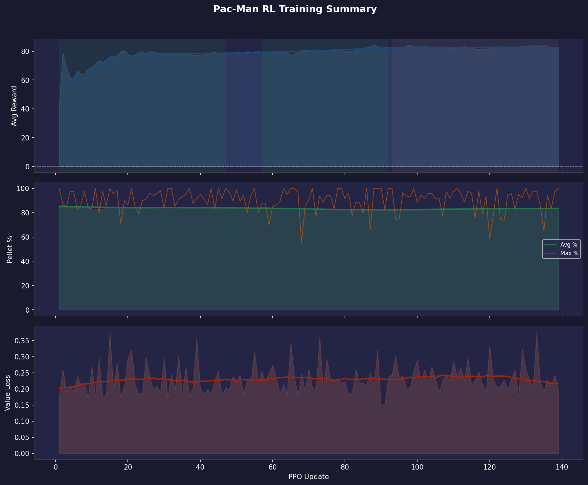

# Training Report 011 — PPO Stage-1

Generated: 2026-08-06 14:33  
Log file: `training_log.txt`

---

## Run Configuration

| Parameter | Value |
|-----------|-------|
| PPO Updates | 1 → 139 (139 logged) |
| Total Episodes | 288 |
| Rollout Steps / Update | 1024 |
| PPO Epochs | 4 |
| Mini-batch Size | 64 |
| Learning Rate | 1e-4 |
| Gamma (γ) | 0.99 |
| GAE Lambda (λ) | 0.95 |
| Clip ε | 0.2 |
| Entropy Coef | 0.05 |
| Value Coef | 0.5 |
| Max Grad Norm | 0.5 |

---

## Observation Format

Each step the model receives **3 tensors**:

### 1. Grid (`[1, C, H, W]` CNN input)
| Channel | Content |
|---------|---------|
| 0 | Walls (maze structure) |
| 1 | Pellets (normal, value 1) |
| 2 | Super-pellets (value 2) |
| 3 | Player position |
| 4 | Ghosts (all combined) |
| 5 | BFS distance-to-player heatmap (normalized) |

### 2. Extra Features (`[1, F]` MLP input)
| Feature | Description |
|---------|-------------|
| player_grid_x | Normalized column position |
| player_grid_y | Normalized row position |
| remaining_pellets | Fraction of pellets left |
| ghost_count | Number of active ghosts |
| ghost_min_dist | Closest ghost BFS distance (normalized) |
| powered_mode | 1 if player is in powered/attack mode |

### 3. Valid Actions (`[1, 4]` mask)
Binary mask over `[UP, DOWN, LEFT, RIGHT]` — invalid moves are masked to −∞ before softmax.

---

## Reward System (as implemented in `player_env.py`)

| Event | Reward |
|-------|--------|
| Every step (base penalty) | **−0.2** |
| Oscillating move (A→B→A) | **−0.5** |
| Pellet eaten | **+5.0** |
| Super-pellet eaten | **+10.0** |
| Ghost eaten (in powered mode) | **+30.0** |
| Level completed | **+200.0** + remaining_steps bonus |
| Pac-Man died | **−30.0** |
| BFS shaping (distance to nearest pellet) | **0.3 × Δpotential** |

---

## Results Summary

| Metric | Value | At Update |
|--------|-------|-----------|
| Best raw avg reward | 84.4 | 88 |
| Best smoothed avg reward | 82.8 | 100 |
| Best avg pellet % | 86.4% | 2 |
| Best max pellet % | 100.0% | 1 |
| Final avg reward | 81.9 | 139 |
| Final avg pellet % | 83.7% | 139 |
| Final max pellet % | 100.0% | 139 |

---

## Reward Trend Diagnostics

Reward-vs-pellet correlation (smoothed): **-0.77**
Episode-to-window reward volatility (std): **28.4**
Reward-vs-maze-size correlation (smoothed): **0.56**
Wide-window residual ratio: **0.61**

### Reward Breakdown Summary

| Component | Avg per Episode |
|-----------|----------------|
| Largest positive | Super (+152.6) |
| Largest penalty | Oscillation (-114.1) |

Component correlations with total reward:

| Component | Correlation |
|-----------|-------------|
| Super | 0.75 |
| Step | -0.67 |
| Ghost | nan |
| Complete | -0.70 |
| Osc | -0.64 |
| Pellet | 0.30 |
| Death | nan |
| BFS | 0.74 |

Time spent in each trend regime (by update count):

| Regime | % of run |
|--------|----------|
| Improving | 60% |
| Plateau | 34% |
| Declining | 0% |

### Segments

| Updates | Regime | Avg slope (Δreward/upd) |
|---------|--------|---------------------------|
| 1–47 | improving | +0.4247 |
| 57–92 | improving | +0.0755 |
| 93–139 | plateau | +0.0142 |

### What this run suggests

- Reward is still trending up for a meaningful share of the run (~60% improving). Worth letting this configuration keep training before changing anything.
- Reward and pellet completion are weakly correlated (corr=-0.77). Reward is moving for reasons other than pellet progress — check how much of it comes from the BFS shaping, oscillation penalty, or per-step cost; the agent may be optimizing those instead.
- Per-episode reward is noisy relative to the smoothed trend (episode-to-window std ≈ 28.4). Individual episodes still swing a lot — consider whether the maze size/seed randomization is creating too much variance per update, or whether more PPO epochs/rollout steps would help it settle.
- The oscillation mostly survives a much wider smoothing window (~61% of the standard-smoothed curve's variance remains). That argues against pure window-sampling noise — this looks like a real, slower-cycle pattern in training itself (e.g. an LR/entropy interaction, or periodic instability), not just averaging artifacts.
- Reward has a mild correlation with average maze size in the window (corr=0.56) — maze-mix is probably a partial contributor to the swings, but not the whole story.
- **Reward breakdown:** the largest positive driver is **Super** (avg +152.6/ep). The largest penalty is **Oscillation** (avg -114.1/ep).
- BFS shaping (corr=0.74) correlates with total reward more strongly than raw pellet reward (corr=0.30). The agent may be optimizing the distance heuristic instead of actual pellets — consider lowering `bfs_shaping_coef`.
- Oscillation penalty is strongly anti-correlated with total reward (corr=-0.64). Back-and-forth movement is still a significant problem — you may want to increase the penalty magnitude or tighten the detection window.

---

## Plots

| File | Description |
|------|-------------|
| `00_overview.png` | Combined 3-panel summary (reward / pellets / value loss) |
| `01_avg_reward.png` | Average episode reward, shaded by trend regime |
| `02_pellet_completion.png` | Pellet completion % (avg & max) |
| `03_value_loss.png` | Value network loss |
| `04_reward_trend.png` | Local reward slope — where training is/isn't progressing |
| `05_reward_vs_pellets.png` | Reward vs pellet completion, dual-axis |
| `06_epoch_vs_window_reward.png` | Instantaneous epoch reward vs the smoothed sliding-window average |
| `07_reward_vs_maze_size.png` | Reward vs average maze size in the window |
| `08_smoothing_window_check.png` | Standard vs. wide smoothing — tests whether the oscillation is window noise |
| `09_reward_breakdown.png` | Per-component reward contribution over time |
| `10_positive_composition.png` | Stacked positive rewards (pellet, super, ghost, complete, BFS) |
| `11_penalty_composition.png` | Stacked penalties (step, oscillation, death) |
| `12_component_importance.png` | Each component as % of total |reward| |

---

## Notes / Observations

<!-- Add manual notes about this run here -->
- Training data covers updates 1–139 (288 episodes).
- Log window size: last 100 completed episodes per update (smoothed breakdown).
