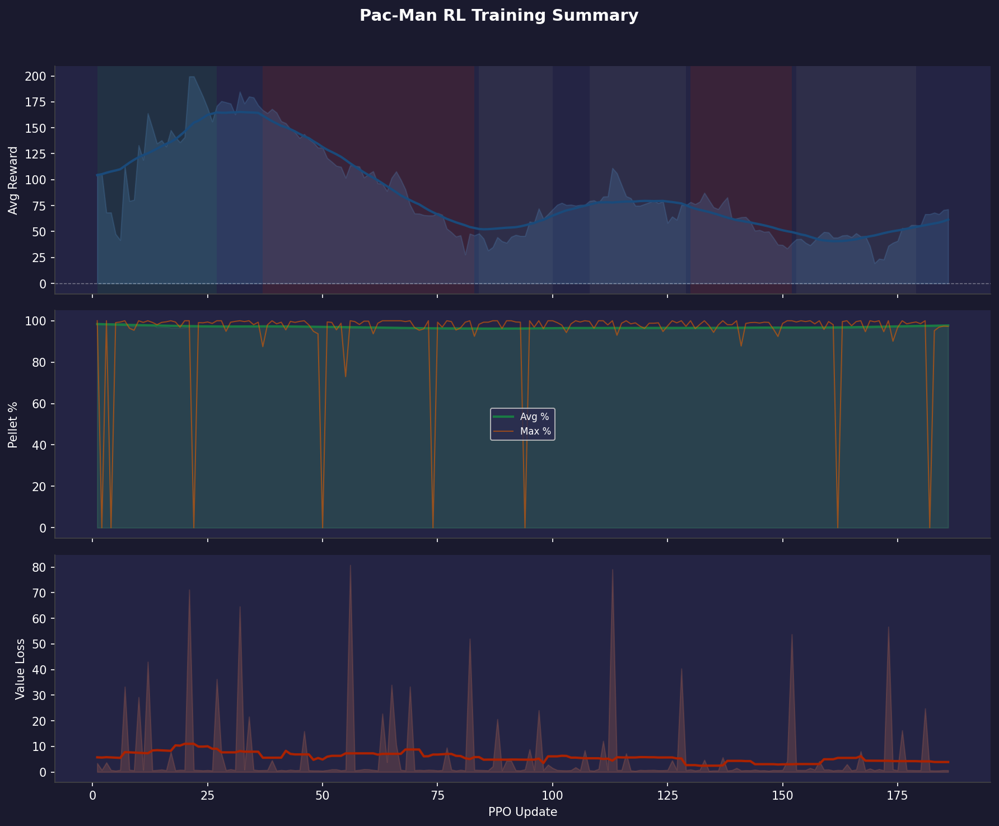

# Training Report 012 — PPO Stage-1

Generated: 2026-08-07 07:52  
Log file: `training_log.txt`

---

## Run Configuration

| Parameter | Value |
|-----------|-------|
| PPO Updates | 1 → 186 (186 logged) |
| Total Episodes | 341 |
| Rollout Steps / Update | 1024 |
| PPO Epochs | 4 |
| Mini-batch Size | 64 |
| Learning Rate | 1e-4 |
| Gamma (γ) | 0.99 |
| GAE Lambda (λ) | 0.95 |
| Clip ε | 0.2 |
| Entropy Coef | 0.05 |
| Value Coef | 0.5 |
| Max Grad Norm | 0.5 |

---

## Observation Format

Each step the model receives **3 tensors**:

### 1. Grid (`[1, C, H, W]` CNN input)
| Channel | Content |
|---------|---------|
| 0 | Walls (maze structure) |
| 1 | Pellets (normal, value 1) |
| 2 | Super-pellets (value 2) |
| 3 | Player position |
| 4 | Ghosts (all combined) |
| 5 | BFS distance-to-player heatmap (normalized) |

### 2. Extra Features (`[1, F]` MLP input)
| Feature | Description |
|---------|-------------|
| player_grid_x | Normalized column position |
| player_grid_y | Normalized row position |
| remaining_pellets | Fraction of pellets left |
| ghost_count | Number of active ghosts |
| ghost_min_dist | Closest ghost BFS distance (normalized) |
| powered_mode | 1 if player is in powered/attack mode |

### 3. Valid Actions (`[1, 4]` mask)
Binary mask over `[UP, DOWN, LEFT, RIGHT]` — invalid moves are masked to −∞ before softmax.

---

## Reward System (as implemented in `player_env.py`)

| Event | Reward |
|-------|--------|
| Every step (base penalty) | **−0.2** |
| Oscillating move (A→B→A) | **−0.5** |
| Pellet eaten | **+5.0** |
| Super-pellet eaten | **+10.0** |
| Ghost eaten (in powered mode) | **+30.0** |
| Level completed | **+200.0** + remaining_steps bonus |
| Pac-Man died | **−30.0** |
| BFS shaping (distance to nearest pellet) | **0.3 × Δpotential** |

---

## Results Summary

| Metric | Value | At Update |
|--------|-------|-----------|
| Best raw avg reward | 199.5 | 21 |
| Best smoothed avg reward | 165.3 | 32 |
| Best avg pellet % | 98.8% | 6 |
| Best max pellet % | 100.0% | 1 |
| Final avg reward | 71.4 | 186 |
| Final avg pellet % | 97.9% | 186 |
| Final max pellet % | 97.3% | 186 |

---

## Reward Trend Diagnostics

Reward-vs-pellet correlation (smoothed): **0.53**
Episode-to-window reward volatility (std): **277.0**
Reward-vs-maze-size correlation (smoothed): **-0.50**
Wide-window residual ratio: **0.70**

### Reward Breakdown Summary

| Component | Avg per Episode |
|-----------|----------------|
| Largest positive | BFS (+486.1) |
| Largest penalty | Step (-594.2) |

Component correlations with total reward:

| Component | Correlation |
|-----------|-------------|
| Step | 0.51 |
| Pellet | -0.51 |
| Osc | 0.43 |
| Super | 0.14 |
| Ghost | nan |
| Complete | 0.59 |
| Death | nan |
| BFS | -0.44 |

Time spent in each trend regime (by update count):

| Regime | % of run |
|--------|----------|
| Improving | 15% |
| Plateau | 35% |
| Declining | 38% |

### Segments

| Updates | Regime | Avg slope (Δreward/upd) |
|---------|--------|---------------------------|
| 1–27 | improving | +1.7575 |
| 37–83 | declining | -1.8182 |
| 84–100 | plateau | +0.1206 |
| 108–129 | plateau | +0.0023 |
| 130–152 | declining | -0.8331 |
| 153–179 | plateau | +0.0306 |

### What this run suggests

- Reward is declining across ~38% of the run. That usually means an unstable update (LR too high, value loss diverging, or a shaping term that's easy to exploit in a way that eventually collapses behavior) rather than something more training will fix.
- Reward and pellet completion are moderately correlated (corr=0.53).
- Per-episode reward is noisy relative to the smoothed trend (episode-to-window std ≈ 277.0). Individual episodes still swing a lot — consider whether the maze size/seed randomization is creating too much variance per update, or whether more PPO epochs/rollout steps would help it settle.
- The oscillation mostly survives a much wider smoothing window (~70% of the standard-smoothed curve's variance remains). That argues against pure window-sampling noise — this looks like a real, slower-cycle pattern in training itself (e.g. an LR/entropy interaction, or periodic instability), not just averaging artifacts.
- Reward correlates negatively with average maze size in the window (corr=-0.50) — windows with bigger mazes score lower, exactly as expected if maze-mix variance is a real contributor to the swings. Consider reporting reward/pellet % stratified by maze-size bucket instead of pooled, since the pooled curve will keep oscillating even once the policy stops improving.
- **Reward breakdown:** the largest positive driver is **BFS** (avg +486.1/ep). The largest penalty is **Step** (avg -594.2/ep).
- BFS shaping (corr=-0.44) correlates with total reward more strongly than raw pellet reward (corr=-0.51). The agent may be optimizing the distance heuristic instead of actual pellets — consider lowering `bfs_shaping_coef`.

---

## Plots

| File | Description |
|------|-------------|
| `00_overview.png` | Combined 3-panel summary (reward / pellets / value loss) |
| `01_avg_reward.png` | Average episode reward, shaded by trend regime |
| `02_pellet_completion.png` | Pellet completion % (avg & max) |
| `03_value_loss.png` | Value network loss |
| `04_reward_trend.png` | Local reward slope — where training is/isn't progressing |
| `05_reward_vs_pellets.png` | Reward vs pellet completion, dual-axis |
| `06_epoch_vs_window_reward.png` | Instantaneous epoch reward vs the smoothed sliding-window average |
| `07_reward_vs_maze_size.png` | Reward vs average maze size in the window |
| `08_smoothing_window_check.png` | Standard vs. wide smoothing — tests whether the oscillation is window noise |
| `09_reward_breakdown.png` | Per-component reward contribution over time |
| `10_positive_composition.png` | Stacked positive rewards (pellet, super, ghost, complete, BFS) |
| `11_penalty_composition.png` | Stacked penalties (step, oscillation, death) |
| `12_component_importance.png` | Each component as % of total |reward| |

---

## Notes / Observations

<!-- Add manual notes about this run here -->
- Training data covers updates 1–186 (341 episodes).
- Log window size: last 100 completed episodes per update (smoothed breakdown).
