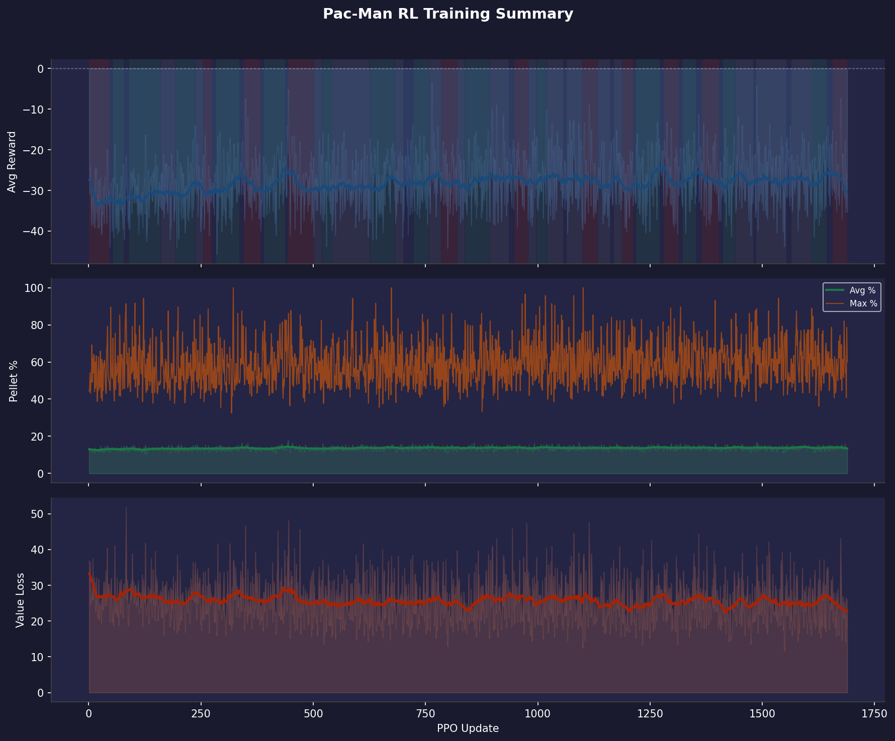

# Training Report 016 — PPO Stage-1

Generated: 2026-08-07 22:21  
Log file: `training_log.txt`

---

## Run Configuration

| Parameter | Value |
|-----------|-------|
| PPO Updates | 1 → 1689 (1689 logged) |
| Total Episodes | 180818 |
| Rollout Steps / Update | 1024 |
| PPO Epochs | 4 |
| Mini-batch Size | 64 |
| Learning Rate | 1e-4 |
| Gamma (γ) | 0.99 |
| GAE Lambda (λ) | 0.95 |
| Clip ε | 0.2 |
| Entropy Coef | 0.05 |
| Value Coef | 0.5 |
| Max Grad Norm | 0.5 |

---

## Observation Format

Each step the model receives **3 tensors**:

### 1. Grid (`[1, C, H, W]` CNN input)
| Channel | Content |
|---------|---------|
| 0 | Walls (maze structure) |
| 1 | Pellets (normal, value 1) |
| 2 | Super-pellets (value 2) |
| 3 | Player position |
| 4 | Ghosts (all combined) |
| 5 | BFS distance-to-player heatmap (normalized) |

### 2. Extra Features (`[1, F]` MLP input)
| Feature | Description |
|---------|-------------|
| player_grid_x | Normalized column position |
| player_grid_y | Normalized row position |
| remaining_pellets | Fraction of pellets left |
| ghost_count | Number of active ghosts |
| ghost_min_dist | Closest ghost BFS distance (normalized) |
| powered_mode | 1 if player is in powered/attack mode |

### 3. Valid Actions (`[1, 4]` mask)
Binary mask over `[UP, DOWN, LEFT, RIGHT]` — invalid moves are masked to −∞ before softmax.

---

## Reward System (as implemented in `player_env.py`)

| Event | Reward |
|-------|--------|
| Every step (base penalty) | **−0.2** |
| Oscillating move (A→B→A) | **−0.5** |
| Pellet eaten | **+5.0** |
| Super-pellet eaten | **+10.0** |
| Ghost eaten (in powered mode) | **+30.0** |
| Level completed | **+200.0** + remaining_steps bonus |
| Pac-Man died | **−30.0** |
| BFS shaping (distance to nearest pellet) | **0.3 × Δpotential** |

---

## Results Summary

| Metric | Value | At Update |
|--------|-------|-----------|
| Best raw avg reward | -3.4 | 764 |
| Best smoothed avg reward | -24.2 | 1277 |
| Best avg pellet % | 17.9% | 444 |
| Best max pellet % | 100.0% | 322 |
| Final avg reward | -35.4 | 1689 |
| Final avg pellet % | 12.8% | 1689 |
| Final max pellet % | 60.0% | 1689 |

---

## Reward Trend Diagnostics

Reward-vs-pellet correlation (smoothed): **0.88**
Episode-to-window reward volatility (std): **1.7**
Reward-vs-maze-size correlation (smoothed): **-0.06**
Wide-window residual ratio: **0.82**

### Reward Breakdown Summary

| Component | Avg per Episode |
|-----------|----------------|
| Largest positive | Ghost (+18.1) |
| Largest penalty | Death (-50.0) |

Component correlations with total reward:

| Component | Correlation |
|-----------|-------------|
| Ghost | 0.98 |
| Pellet | 0.87 |
| Super | 0.82 |
| Step | -0.61 |
| Osc | 0.52 |
| Death | 0.12 |
| Complete | 0.11 |
| BFS | nan |

Time spent in each trend regime (by update count):

| Regime | % of run |
|--------|----------|
| Improving | 34% |
| Plateau | 33% |
| Declining | 23% |

### Segments

| Updates | Regime | Avg slope (Δreward/upd) |
|---------|--------|---------------------------|
| 1–47 | declining | -0.0530 |
| 54–78 | improving | +0.0163 |
| 90–160 | improving | +0.0203 |
| 161–193 | plateau | -0.0026 |
| 194–237 | improving | +0.0235 |
| 238–255 | plateau | +0.0014 |
| 256–274 | declining | -0.0175 |
| 284–335 | improving | +0.0425 |
| 345–383 | declining | -0.0341 |
| 390–437 | improving | +0.0494 |
| 444–501 | declining | -0.0483 |
| 502–519 | plateau | +0.0016 |
| 520–542 | improving | +0.0152 |
| 543–625 | plateau | -0.0007 |
| 626–681 | improving | +0.0231 |
| 682–700 | plateau | -0.0007 |
| 724–758 | improving | +0.0221 |
| 759–784 | plateau | -0.0003 |
| 785–820 | declining | -0.0287 |
| 821–837 | plateau | +0.0019 |
| 838–892 | improving | +0.0255 |
| 893–935 | plateau | +0.0030 |
| 948–978 | declining | -0.0167 |
| 979–996 | plateau | +0.0005 |
| 997–1020 | improving | +0.0173 |
| 1021–1057 | plateau | +0.0012 |
| 1064–1099 | plateau | -0.0043 |
| 1100–1133 | declining | -0.0231 |
| 1134–1162 | plateau | -0.0077 |
| 1169–1188 | plateau | -0.0062 |
| 1189–1212 | declining | -0.0164 |
| 1219–1271 | improving | +0.0476 |
| 1281–1314 | declining | -0.0310 |
| 1323–1352 | improving | +0.0243 |
| 1365–1403 | declining | -0.0289 |
| 1412–1439 | improving | +0.0170 |
| 1440–1480 | plateau | +0.0007 |
| 1486–1554 | plateau | -0.0024 |
| 1565–1609 | plateau | -0.0006 |
| 1610–1643 | improving | +0.0229 |
| 1657–1689 | declining | -0.0637 |

### What this run suggests

- Reward is still trending up for a meaningful share of the run (~34% improving). Worth letting this configuration keep training before changing anything.
- Reward and pellet completion move together closely (corr=0.88). Reward increases are coming from actually eating more pellets — the shaping is aligned with the real objective.
- The oscillation mostly survives a much wider smoothing window (~82% of the standard-smoothed curve's variance remains). That argues against pure window-sampling noise — this looks like a real, slower-cycle pattern in training itself (e.g. an LR/entropy interaction, or periodic instability), not just averaging artifacts.
- Reward doesn't correlate much with average maze size in the window (corr=-0.06) — maze-mix doesn't look like the driver of the oscillation here, so it's more likely coming from training dynamics.
- **Reward breakdown:** the largest positive driver is **Ghost** (avg +18.1/ep). The largest penalty is **Death** (avg -50.0/ep).
- Pellet reward (corr=0.87) dominates over BFS shaping (corr=nan) — the shaping term is well-calibrated.

---

## Plots

| File | Description |
|------|-------------|
| `00_overview.png` | Combined 3-panel summary (reward / pellets / value loss) |
| `01_avg_reward.png` | Average episode reward, shaded by trend regime |
| `02_pellet_completion.png` | Pellet completion % (avg & max) |
| `03_value_loss.png` | Value network loss |
| `04_reward_trend.png` | Local reward slope — where training is/isn't progressing |
| `05_reward_vs_pellets.png` | Reward vs pellet completion, dual-axis |
| `06_epoch_vs_window_reward.png` | Instantaneous epoch reward vs the smoothed sliding-window average |
| `07_reward_vs_maze_size.png` | Reward vs average maze size in the window |
| `08_smoothing_window_check.png` | Standard vs. wide smoothing — tests whether the oscillation is window noise |
| `09_reward_breakdown.png` | Per-component reward contribution over time |
| `10_positive_composition.png` | Stacked positive rewards (pellet, super, ghost, complete, BFS) |
| `11_penalty_composition.png` | Stacked penalties (step, oscillation, death) |
| `12_component_importance.png` | Each component as % of total |reward| |

---

## Notes / Observations

<!-- Add manual notes about this run here -->
- Training data covers updates 1–1689 (180818 episodes).
- Log window size: last 100 completed episodes per update (smoothed breakdown).
