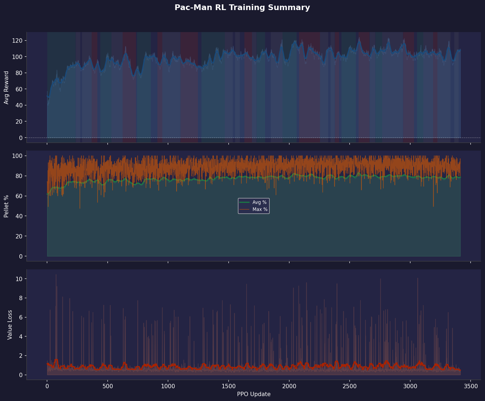

# Training Report 010 — PPO Stage-1

Generated: 2026-08-05 02:18  
Log file: `RL_logs.txt`

---

## Run Configuration

| Parameter | Value |
|-----------|-------|
| PPO Updates | 1 → 3414 (3412 logged) |
| Total Episodes | 12434 |
| Rollout Steps / Update | 512 |
| PPO Epochs | 4 |
| Mini-batch Size | 64 |
| Learning Rate | 3e-4 |
| Gamma (γ) | 0.99 |
| GAE Lambda (λ) | 0.95 |
| Clip ε | 0.2 |
| Entropy Coef | 0.02 |
| Value Coef | 0.5 |
| Max Grad Norm | 0.5 |

---

## Observation Format

Each step the model receives **3 tensors**:

### 1. Grid (`[1, C, H, W]` CNN input)
| Channel | Content |
|---------|---------|
| 0 | Walls (maze structure) |
| 1 | Pellets (normal, value 1) |
| 2 | Super-pellets (value 2) |
| 3 | Player position |
| 4 | Ghosts (all combined) |
| 5 | BFS distance-to-player heatmap (normalized) |

### 2. Extra Features (`[1, F]` MLP input)
| Feature | Description |
|---------|-------------|
| player_grid_x | Normalized column position |
| player_grid_y | Normalized row position |
| remaining_pellets | Fraction of pellets left |
| ghost_count | Number of active ghosts |
| ghost_min_dist | Closest ghost BFS distance (normalized) |
| powered_mode | 1 if player is in powered/attack mode |

### 3. Valid Actions (`[1, 4]` mask)
Binary mask over `[UP, DOWN, LEFT, RIGHT]` — invalid moves are masked to −∞ before softmax.

---

## Reward System

| Event | Reward |
|-------|--------|
| Every step (base penalty) | **−0.2** |
| Oscillating move (reversed within 6 steps) | **−0.3** *(active from report_002)* |
| First visit to a new grid tile | **+0.5** |
| Pellet eaten | **+5.0** |
| Super-pellet eaten | **+15.0** |
| Ghost eaten (in powered mode) | **+30.0** |
| Level completed | **+100.0** |
| Pac-Man died | **−20.0** |

**Net examples:**
- Step forward into a new pellet tile: `−0.2 + 0.5 + 5.0 = +5.3`
- Step forward into a new empty tile: `−0.2 + 0.5 = +0.3`
- Step forward into an already-visited tile: `−0.2`
- Oscillating move (back-track): `−0.2 − 0.3 = −0.5` *(active from report_002)*

---

## Results Summary

| Metric | Value | At Update |
|--------|-------|-----------|
| Best raw avg reward | 124.1 | 2578 |
| Best smoothed avg reward | 118.4 | 2578 |
| Best avg pellet % | 84.3% | 2573 |
| Best max pellet % | 100.0% | 24 |
| Final avg reward | 108.0 | 3414 |
| Final avg pellet % | 79.2% | 3414 |
| Final max pellet % | 92.3% | 3414 |

---

## Reward Trend Diagnostics

Reward-vs-pellet correlation (smoothed): **0.95**
Episode-to-window reward volatility (std): **33.6**
*(Log has no `Avg Maze Area` field yet — add it to the logger to check whether random maze-size variance is driving the oscillation.)*
Wide-window residual ratio (how much of the wiggle survives heavy smoothing): **0.54**

Time spent in each trend regime (by update count):

| Regime | % of run |
|--------|----------|
| Improving | 31% |
| Plateau | 33% |
| Declining | 24% |

### Segments

| Updates | Regime | Avg slope (Δreward/upd) |
|---------|--------|---------------------------|
| 1–236 | improving | +0.1532 |
| 237–273 | plateau | +0.0208 |
| 289–368 | plateau | +0.0024 |
| 369–416 | declining | -0.0526 |
| 440–531 | improving | +0.0615 |
| 532–624 | plateau | +0.0113 |
| 625–733 | declining | -0.1001 |
| 744–858 | improving | +0.1252 |
| 912–951 | declining | -0.0401 |
| 952–1101 | plateau | +0.0053 |
| 1102–1246 | declining | -0.0491 |
| 1275–1468 | improving | +0.0763 |
| 1469–1533 | plateau | +0.0071 |
| 1554–1592 | plateau | -0.0230 |
| 1631–1693 | declining | -0.0386 |
| 1694–1730 | plateau | -0.0009 |
| 1731–1800 | improving | +0.0427 |
| 1849–1944 | plateau | -0.0063 |
| 1945–2061 | improving | +0.0897 |
| 2081–2254 | declining | -0.0551 |
| 2255–2321 | plateau | +0.0144 |
| 2342–2376 | plateau | +0.0073 |
| 2377–2412 | declining | -0.0481 |
| 2433–2550 | improving | +0.0697 |
| 2573–2664 | declining | -0.0503 |
| 2665–2711 | plateau | +0.0133 |
| 2712–2768 | improving | +0.0469 |
| 2769–2940 | plateau | -0.0002 |
| 2941–3031 | declining | -0.0633 |
| 3057–3108 | improving | +0.0315 |
| 3109–3189 | plateau | -0.0008 |
| 3190–3224 | declining | -0.0427 |
| 3225–3332 | plateau | -0.0066 |
| 3365–3400 | plateau | +0.0052 |

### What this run suggests

- Reward is still trending up for a meaningful share of the run (~31% improving). Worth letting this configuration keep training before changing anything.
- Reward and pellet completion move together closely (corr=0.95). Reward increases are coming from actually eating more pellets — the shaping is aligned with the real objective.
- Per-episode reward is noisy relative to the smoothed trend (episode-to-window std ≈ 33.6). Individual episodes still swing a lot — consider whether the maze size/seed randomization is creating too much variance per update, or whether more PPO epochs/rollout steps would help it settle.
- The oscillation mostly survives a much wider smoothing window (~54% of the standard-smoothed curve's variance remains). That argues against pure window-sampling noise — this looks like a real, slower-cycle pattern in training itself (e.g. an LR/entropy interaction, or periodic instability), not just averaging artifacts.

---

## Plots

| File | Description |
|------|-------------|
| `00_overview.png` | Combined 3-panel summary (reward / pellets / value loss) |
| `01_avg_reward.png` | Average episode reward, shaded by trend regime |
| `02_pellet_completion.png` | Pellet completion % (avg & max) |
| `03_value_loss.png` | Value network loss |
| `04_reward_trend.png` | Local reward slope — where training is/isn't progressing |
| `05_reward_vs_pellets.png` | Reward vs pellet completion, dual-axis |
| `06_epoch_vs_window_reward.png` | Instantaneous epoch reward vs the smoothed sliding-window average |

| `08_smoothing_window_check.png` | Standard vs. wide smoothing — tests whether the oscillation is window noise |

---

## Notes / Observations

<!-- Add manual notes about this run here -->
- Training data covers updates 1–3414 (12434 episodes).
- Log window size: last 20 completed episodes per update.
- Oscillation penalty introduced in this run to combat node-to-node back-and-forth behavior.
