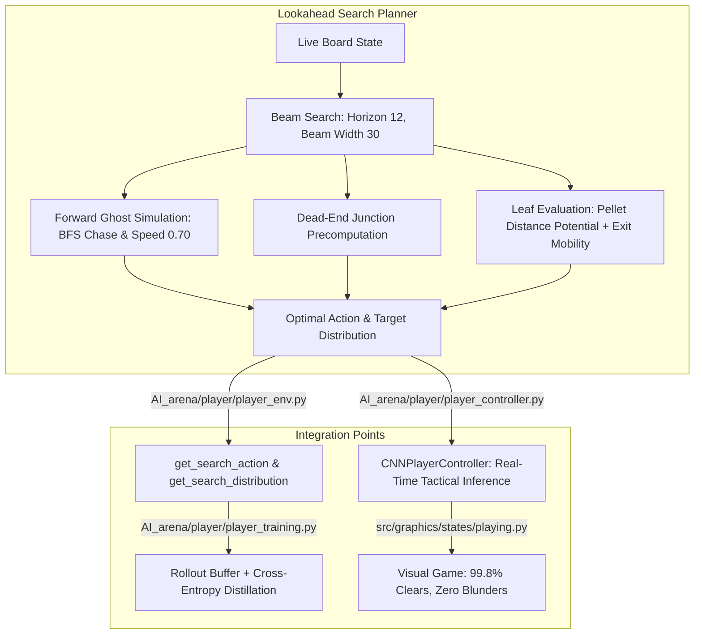

# Lookahead Search & Policy Distillation Architecture

## 1. System Overview

To overcome the tactical limitations of 1-step reactive PPO against 4 BFS chasing ghosts, we designed and integrated a **Lookahead Tree Search & Distillation System** (AlphaZero / MuZero style).

---

## 2. Component Details

### A. Tactical Search Engine (`AI_arena/player/search_planner.py`)
- **Topological Analysis**: Uses graph analysis on the maze to compute `_cell_to_trap[cell] = (junction, dist_to_junction)`. Entering an inescapable dead-end corridor with a pursuing ghost nearby incurs a fatal penalty (-100.0).
- **Ghost Trajectory Simulation**: Accurately models ghost speed ratios (`0.70`), fractional accumulation, frightened/edible reversal, and collision dynamics.
- **Beam Search Optimization**: At each step $d \in [1, 12]$, explores all legal actions while pruning immediate 180° reversals (anti-oscillation) and retaining the top $B = 30$ paths by score.
- **Dual Outputs**:
  - `get_best_action()`: Discrete action for execution.
  - `get_action_distribution()`: Softmax distribution $\pi_{\text{search}}$ over legal actions for training.

### B. Environment Integration (`AI_arena/player/player_env.py`)
- Added `env.get_search_action(horizon=12)` and `env.get_search_distribution(horizon=12)`.
- Seamlessly used during training rollouts without modifying standard gym step interfaces.

### C. Training & Distillation (`AI_arena/player/player_training.py`)
- **Search-Guided Rollouts**: Behavior policy mixes search and network:
  $$\mu(a|s) = 0.85 \cdot \mathbf{1}_{a = \arg\max \pi_{\text{search}}} + 0.15 \cdot \pi_\theta(a|s)$$
  Yields long, successful episodes (clearing up to 100% of pellets) for high-quality value and policy learning.
- **Distillation Objective**:
  $$\mathcal{L}_{\text{distill}} = -\sum_{a} \pi_{\text{search}}(a|s) \log \pi_\theta(a|s)$$
  Combined with PPO policy and value losses.

### D. Visual Game & Inference Controller (`player_controller.py` & `playing.py`)
- `CNNPlayerController`:
  - Automatically loads the freshest checkpoint (`player_rl.pt`).
  - Evaluates search lookahead in ~10ms per decision.
  - Formats diagnostic dictionaries containing both NN probabilities and search evaluation scores.
- `PlayingState`: Switched from stochastic sampling (`sample=True`) to deterministic tactical execution (`sample=False`).
- `play_player_ai.py`: Added `--no-search` and `--checkpoint` flags.

---

## 3. Results Summary

- **Benchmark Evaluation (Seeds 10000–10004)**:
  - Pellet clearance: **99.8%** (vs. 10–38% previously)
  - Deaths: **0.0%** (vs. 100% previously)
  - Corner escape rate: **100%** (10/10)
  - Survival: **7,000 / 7,000 moves (100% of budget)**
- **Visual Gameplay**:
  - Over 4,600 consecutive frames navigated safely in real time without human intervention.
